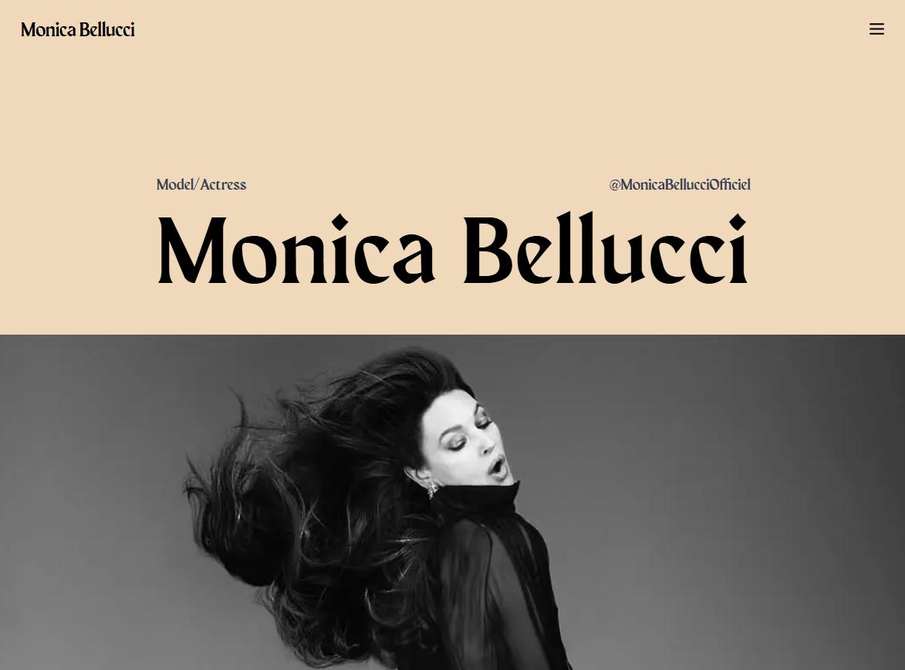

# Monica Bellucci Portfolio



## Overview

A stunning, animated hero section showcasing Monica Bellucci's portfolio. The project features sophisticated animations powered by GSAP timeline, creating an immersive and elegant viewing experience. The design emphasizes visual storytelling through smooth transitions and dynamic content presentation.

## Tech Stack

- **Frontend Framework:** `React`
- **Build Tool:** `Vite`
- **Language:** `TypeScript`
- **Animation:** `GSAP` (GreenSock Animation Platform)
- **Styling:** `TailwindCSS`
- **Font Assets:** (Darker Grotesque, Maragsa Display)

## Project Structure

```
src/
├── assets/
│   ├── fonts/              # Custom typography assets
│   └── img/               # Image resources
├── components/
│   ├── Header.tsx         # Main header component
│   ├── hero/              # Hero section components
│   │   ├── animations.ts  # GSAP animation definitions
│   │   ├── constants.ts   # Hero section constants
│   │   └── Hero.tsx      # Main hero component
│   └── ui/
│       └── Image.tsx      # Reusable image component
├── hooks/
│   └── useMediaQuery.ts   # Custom hook for responsive design
└── lib/
    └── utils.ts          # Utility functions
```

## Features

- Component-based architecture
- Smooth GSAP animations
- Responsive design
- Optimized image loading with WebP format
